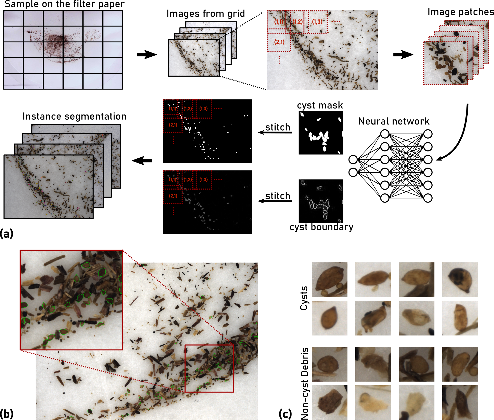
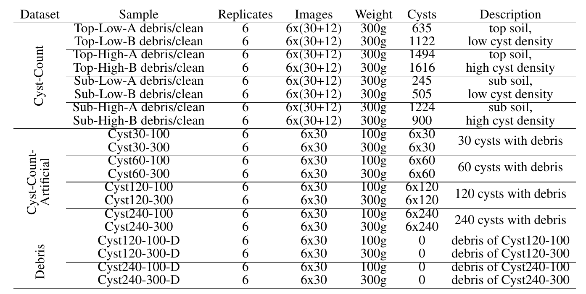

# High-throughput Phenotyping of Nematode Cysts

## Contents

- [Overview](#overview)
- [Datasets](#datasets)
- [Trained Models](#trained-models)
- [Results](#results)
- [Citation](#citation)

## Overview

<p align="center">

</p>

The beet cyst nematode *Heterodera schachtii* is a plant pest responsible for crop loss on a global scale. Here, we introduce a high-throughput system based on computer vision that allows quantifying beet cyst nematode infestation and measuring phenotypic traits of cysts. After recording microscopic images of soil sample extracts in a standardized setting, an instance segmentation algorithm serves to detect nematode cysts in these images. In an evaluation using both ground truth samples with known cyst numbers and manually annotated images, the computer vision approach produced accurate nematode cyst counts, as well as accurate cyst segmentations. Based on such segmentations, cyst features could be computed that served to reveal phenotypical differences between nematode populations in different soils and in populations observed before and after the sugar beet planting period.

The computer vision approach enables not only fast and precise cyst counting, but also phenotyping of cyst features under different conditions, providing the basis for high-throughput applications in agriculture and plant breeding research. Source code and annotated image data sets are freely available for scientific use.

Source code and evaluation data sets are available online for non-commercial use.

For more details, please see the complete paper:  ["*High-throughput Phenotyping of Nematode Cysts*".]()

## Datasets


To validate the cyst detection and segmentation performance of the automated system, we created three image data sets and associated evaluation scenarios:


- *Cyst-Segmentation*: Segmentation scenario. Cyst boundaries were manually annotated on the images. The data set consists of 229 images with a total of 6331 annotated cysts. We randomly split the data into the 80% training set (183 images containing 4937 cysts) and the 20% test set (46 images containing 1394 cysts). The training set was used for training of all models in this work, and the test set served for evaluation of segmentation accuracy. Considering that cysts surrounded by debris particles can easily be overlooked, two raters labeled the data independently with the polygon tool in the annotation software IMANNO developed by LfB (publicly available). The two sets of annotations were then manually merged and validated by a nematologist (co-author Matthias Daub).
- *Cyst-Count*: Cyst counting scenario. The ground truth cyst count was obtained through manual counting. We considered soil samples from two different soil layers (top soil: 0-30 cm, sub soil: 31-60 cm) with either low or high cyst density. For each soil type (Top-Low, Top-High, Sub-Low and Sub-High), we conducted soil sampling before and after the sugar beet growing season, 6 samples each time. A total of 48 samples (4 types x 2 timepoints x 6 samples) were collected, processed and recorded with 30 images per sample (the "debris" sample). For each sample, we further manually separated the cysts from debris particles to obtain the "clean" samples (12 images per sample) that were used as an additional evaluation data set. Cyst separation and counting were performed simultaneously by the professional laboratory staff from JKI.
- *Cyst-Count-Artificial*: Cyst counting scenario. We artificially created samples with exact cyst numbers by adding hand-picked cysts to cyst-free soil extracts. We controlled the cyst count (30, 60, 120 and 240 cysts) and the amount of soil extracts (from 100g and 300g soil sample), generating 6 samples for each combination.

<p align="center">

</p>

The data sets are available:
- *Cyst-Segmentation*: https://zenodo.org/record/6806398 (~7G)
- *Cyst-Count*: [Part1: with debris](https://zenodo.org/record/6861775) (~37G), [Part2: without debris](https://zenodo.org/record/6861814) (~16G)
- *Cyst-Count-Artificial*: https://zenodo.org/record/6870064 (~40G)


## Trained Models

### Requirements

- python=3.x
- tensorflow=2.x
- opencv=4.x
- scikit-image=0.19

### Pre-trained models
| Model | Release Date | Remarks |
| ------------- | ------------- | ------------- |
| [U-Net](https://github.com/looooongChen/PNS-Cyst/blob/main/models/model_uNet.zip) | Jul. 2022 | U-Net trained without augmentation |
| [U-NetA](https://github.com/looooongChen/PNS-Cyst/blob/main/models/model_uNetA.zip) | Jul. 2022 | U-Net trained with augmentation |
| [ResNet50](https://github.com/looooongChen/PNS-Cyst/blob/main/models/model_ResNet50.zip) | Jul. 2022 | ResNet50 trained without augmentation |
| [ResNet50A](https://github.com/looooongChen/PNS-Cyst/blob/main/models/model_ResNet50A.zip) | Jul. 2022 | ResNet50 trained with augmentation |
| [ResNet101](https://github.com/looooongChen/PNS-Cyst/blob/main/models/model_ResNet101.zip) | Jul. 2022 | ResNet101 trained without augmentation |
| [ResNet101A](https://github.com/looooongChen/PNS-Cyst/blob/main/models/model_ResNet101A.zip) | Jul. 2022 | ResNet101 trained with augmentation |

To load the trained model, the python package [*instSeg*](https://github.com/looooongChen/instSeg) developed by us is required. The package instSeg is keeping updated, some compatibility issue may arise. We recommend to use the version included in this repository.

After the installation, you can easily load the model fore prediction:

```
import instSeg
import cv2

img_path = "..."
model_path = "..."

model = instSeg.load_model(model_dir=model_path)
img = cv2.imread(img_path)[:,:,:3]
instance = instSeg.seg_in_tessellation(model, img, patch_sz=[512,512], margin=[0,0], overlap=[128,128], mode='bi')
```


## Results

### 1. Evaluation of counting accuracy.


### 2. Evaluation of segmentation accuracy.


### 3. Image-based phenotyping reveals that nematode populations have characteristic phenotypical features.


## Citation

If you use this code or dataset please cite the paper where the method appeared: 
```
@ARTICLE{10.3389/fpls.2022.965254,
AUTHOR={Chen, Long and Daub, Matthias and Luigs, Hans-Georg and Jansen, Marcus and Strauch, Martin and Merhof, Dorit},   
TITLE={High-throughput phenotyping of nematode cysts},      
JOURNAL={Frontiers in Plant Science},      
VOLUME={13},           
YEAR={2022},      
URL={https://www.frontiersin.org/articles/10.3389/fpls.2022.965254},       
DOI={10.3389/fpls.2022.965254},      
ISSN={1664-462X},   
}
```

